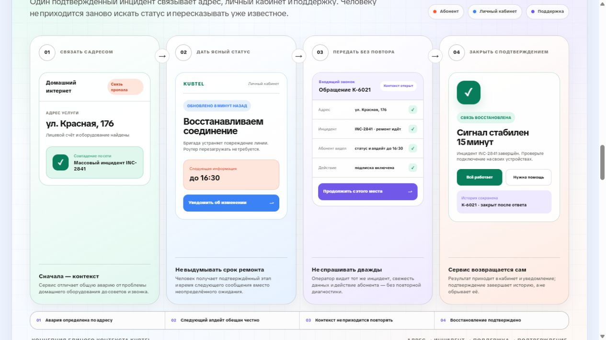
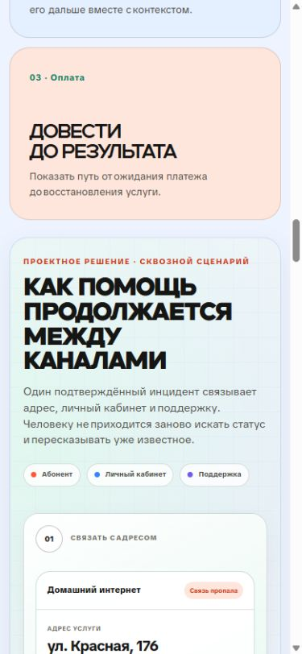

# Сквозной контекст KUBTEL между личным кабинетом и поддержкой

## Зачем здесь нужен визуал

Визуал находится после трёх направлений концепции — авария, обращение и оплата — и перед подробным циклом статуса. В этом месте он должен не повторять тему связи декоративными объектами, а показать, как одна модель состояния работает в реальном эпизоде.

Главный вопрос: **что происходит с уже известной информацией, когда абонент переходит из личного кабинета в поддержку и обратно?**

Выбран сценарий массовой аварии по адресу. Он соединяет главную пользовательскую боль исследования — отсутствие ясного статуса и повторное объяснение проблемы — с операционной задачей поддержки и проверяемым завершением сервиса.

## Что зритель должен понять за несколько секунд

1. Сервис сначала связывает адрес и услугу с конкретным сетевым инцидентом.
2. Абонент получает не выдуманный срок ремонта, а подтверждённый этап и время следующего обновления.
3. При звонке оператор уже видит адрес, номер инцидента, показанный абоненту статус и выполненное действие.
4. После восстановления результат возвращается в кабинет, а история закрывается после ответа абонента.

## Сценарий по шагам

### 1. Связать с адресом

На первом кадре показана не условная иконка дома, а рабочая связь данных: домашний интернет по адресу сопоставлен с массовым инцидентом `INC-2841`.

Практический смысл: сервис отличает общую аварию от локальной проблемы оборудования до выдачи советов и создания обращения.

### 2. Дать ясный статус

Личный кабинет показывает этап ремонта, свежесть информации, понятную инструкцию и следующий подтверждённый апдейт до 16:30. Абонент может подписаться на изменение.

Практический смысл: человек знает, что уже делает компания и когда сервис вернётся с новой информацией, не принимая обещание апдейта за обещание полного ремонта.

### 3. Передать без повтора

При переходе в поддержку оператор открывает обращение `K-6021` и видит тот же адрес, инцидент, текущий этап, показанный срок апдейта и включённую подписку.

Практический смысл: разговор продолжается с текущего места; абоненту не нужно заново называть договор, пересказывать ситуацию и проходить уже ненужную диагностику.

### 4. Закрыть с подтверждением

После восстановления кабинет сообщает, что сигнал стабилен, предлагает подтвердить результат или запросить помощь и сохраняет историю обращения.

Практический смысл: сервис не заканчивается внутренним техническим статусом. Пользователь видит результат и может сообщить, если проблема у него сохранилась.

## Почему прежняя иллюстрация не работала

Файл `site/assets/kubtel-context-chain-light-20260810.png` показывал дом, роутер, стеклянную капсулу с карточками, кольцо и галочку. Эти объекты можно было интерпретировать как угодно. Из изображения нельзя было понять:

- какую проблему обнаружил сервис;
- какая информация показана абоненту;
- что получает оператор поддержки;
- зачем нужен переход между каналами;
- когда и кем подтверждается результат.

Файл оставлен в архиве, но больше не подключается к странице.

## Факты и границы концепции

KUBTEL — интернет-провайдер «Кубань-Телеком». На официальном сайте присутствуют личный кабинет, финансовые разделы и каналы помощи. В опубликованных условиях личный кабинет описан как веб-страница со статистикой услуг и состоянием лицевого счёта.

Персональный статус сетевого инцидента, единый `incident ID`, автоматическая передача контекста в поддержку, обещание следующего апдейта и подтверждение восстановления — проектная концепция. Визуал прямо помечен как «Проектное решение» и не выдаёт её за уже выпущенную функцию.

Публичные отзывы содержат как положительные оценки качества подключения, так и сигналы о трудностях дозвона, отсутствии сроков и обратной связи во время отдельных аварий. Поэтому концепция решает не качество линии само по себе, а вторичную неопределённость вокруг сбоя.

Источники:

- [Официальный сайт KUBTEL](https://kubtel.ru/)
- [Условия оказания услуг и описание личного кабинета](https://kubtel.ru/individual/termsofuse)
- [Публичные отзывы KUBTEL на Яндекс Картах](https://yandex.com/maps/org/kubtel/64998040351/reviews/)

Все адреса, номера инцидентов, обращений и время в макете — демонстрационные данные.

## Почему визуал собран в HTML и CSS

Для этого места важны точные состояния, русские подписи и причинно-следственная связь. Поэтому визуал реализован вручную, а не сгенерирован как растровая метафора:

- текст остаётся настоящим и не содержит псевдосимволов;
- одинаковые идентификаторы можно проверить во всех кадрах;
- каждый элемент интерфейса выполняет конкретную роль;
- схема перестраивается под ширину экрана;
- содержание доступно поиску и программам экранного доступа.

## Визуальный язык

Композиция продолжает общую светлую систему портфолио, но получает собственную сервисную палитру:

- мятный — найденный контекст и подтверждённый результат;
- голубой — личный кабинет и актуальная информация;
- сиреневый — поддержка и передача контекста;
- коралловый — потеря связи и важное обещание следующего обновления;
- тёплый белый — основное поле без декоративного шума.

Цвет не используется как единственный носитель смысла: состояния продублированы текстом, знаками и положением в сценарии.

## Адаптивное поведение

- На широком экране четыре шага читаются слева направо.
- На среднем экране они складываются в сетку 2 × 2 с продолжением истории сверху вниз.
- На мобильном экране шаги образуют вертикальную последовательность с явными стрелками.
- Карточки остаются интерфейсами рабочего размера, а не уменьшаются до нечитаемой картинки.

Проверенные ширины: 1280 и 390 пикселей. Горизонтального переполнения нет.

## Критерии готовности

Человек без устного комментария должен ответить на четыре вопроса:

1. Как сервис понял, что проблема относится к массовой аварии?
2. Что именно обещано абоненту и почему это не фиктивный срок ремонта?
3. Какой контекст уже доступен оператору поддержки?
4. Как сервис сообщает и подтверждает восстановление?

Если любой ответ приходится искать только в соседнем тексте кейса, визуал необходимо упрощать.

## Гипотезы для проверки

- Вероятность, что сквозной сценарий будет понятнее прежней предметной метафоры: **90 %**. Риск неудачи — **10 %**, если зритель воспринимает демонстрационные интерфейсы как уже выпущенный продукт, несмотря на маркировку концепции.
- Вероятность, что персональный статус и обещание следующего апдейта снизят повторные обращения во время массовой аварии: **70 %**. Риск неудачи — **30 %**, если операционный статус обновляется несвоевременно или абоненты не доверяют каналу.
- Вероятность, что готовый контекст обращения уменьшит повторные вопросы и время разговора: **75 %**. Риск неудачи — **25 %**, если CRM и сетевые данные нельзя надёжно связать по адресу и услуге.
- Вероятность, что подтверждение восстановления уменьшит число преждевременно закрытых обращений: **60 %**. Риск неудачи — **40 %**, если большинство абонентов игнорирует уведомление или локальная проблема сохраняется после массового ремонта.

Проценты — экспертная оценка до пилота, а не измеренный эффект. Подтверждение требует исходных метрик, тестирования прототипа и запуска в одном регионе.

## Реализация

- Разметка: `site/case-kubtel.html`, блок `service-handoff-panel`.
- Стили и адаптивная компоновка: `site/styles-v2.css`.
- Положение: раздел «Концепция», между тремя направлениями продукта и циклом статуса.

## Контрольные кадры

Широкий экран:

Мобильный экран:

