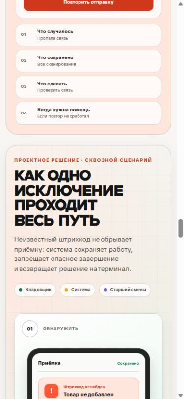

# Сквозной сценарий исключения в «Складе 15»

## Зачем здесь нужен визуал

Иллюстрация находится после четырёх отдельных UX-решений и перед разделом, где они складываются в единую систему. Поэтому её задача — не украсить страницу и не показать складские предметы. Она должна на одном конкретном случае доказать, что решения работают вместе.

Выбран случай неизвестного штрихкода во время приёмки. Он понятен без специальной подготовки и одновременно затрагивает все ключевые риски кейса: сохранность уже выполненной работы, запрет опасного завершения, передачу исключения ответственному человеку и видимый итог в учётной системе.

Главный вопрос визуала: **что произойдёт с проблемным сканированием от момента ошибки до безопасного завершения документа?**

## Что зритель должен понять за несколько секунд

1. Кладовщик сразу видит, что товар не добавлен, а предыдущие 37 сканирований сохранены.
2. Система не разрешает завершить документ с обязательным исключением.
3. Проблема не остаётся на терминале без владельца: она попадает в единый центр исключений вместе с документом, местом и количеством.
4. После решения результат возвращается на терминал; завершение становится доступным, а путь документа прослеживается до учётной системы.

Именно эти четыре вывода подписаны под схемой как практические результаты: ритм приёмки сохранён, неполный документ не закрыт, у исключения есть владелец, решение прослеживается до учёта.

## Сценарий по шагам

### 1. Обнаружить

На экране терминала показано состояние «Штрихкод не найден». Рядом нет декоративных предметов: зритель видит сам рабочий контекст — результат скана, количество сохранённых действий и доступные следующие шаги.

Практический смысл: человек не гадает, был ли товар добавлен и потеряна ли предыдущая работа.

### 2. Сохранить и защитить

Система создаёт исключение, сохраняет контекст документа и блокирует завершение, пока обязательная проблема не решена. Блокируется опасный исход, а не вся работа целиком.

Практический смысл: пользователь не может случайно закрыть неполный документ, но понимает, что произошло и что можно делать дальше.

### 3. Передать ответственному

В предлагаемом центре исключений старший смены получает готовую к разбору задачу: тип проблемы, документ, зону, количество и безопасное действие. В очереди также видны отсутствующая марка и транспортная упаковка — это показывает, что центр рассчитан не на единственный частный случай.

Практический смысл: ответственность становится явной, а на уточнение контекста не тратится отдельный разговор.

### 4. Вернуть результат

После определения товара решение возвращается на терминал. Отдельно показаны проверка завершения и три состояния передачи документа: на терминале, на сервере, принят в учётной системе.

Практический смысл: кладовщик видит не только решение исключения, но и конечный результат всей операции.

## Что подтверждено документацией, а что является концепцией

В документации «Склада 15» описаны настройки, которые разрешают или запрещают работу с неизвестными штрихкодами. При разрешённой обработке товар можно принять как неизвестный или связать штрихкод с товаром. Также в продукте предусмотрена возможность сделать кнопку завершения недоступной, если документ принят не полностью; для загруженного из учётной системы документа остаётся временный выход.

На этих возможностях основаны первые два шага схемы. При этом единый центр исключений, автоматическое назначение старшего смены, сохранение полного контекста и возврат решения на терминал — проектное предложение. На сайте оно честно обозначено как «Проектное решение», а не как уже выпущенная функция.

Источники:

- [Работа с неизвестными штрихкодами](https://kb.cleverence.ru/wh15/1.6/what-to-do-with-unknown-barcodes-in-warehouse-15/)
- [Запрет завершения неполного документа](https://kb.cleverence.ru/wh15/1.6/how-to-prevent-document-completion)
- [Агрегация маркированного товара в транспортную упаковку](https://kb.cleverence.ru/wh15/aggregation-of-marked-goods-in-warehouse-15/)

## Почему это не растровая генерация

Схема собрана вручную в HTML и CSS. Для этого визуала точность важнее декоративного объёма:

- русские подписи должны быть без ошибок и псевдотекста;
- состояния интерфейса должны быть логически связаны;
- геометрия терминала, карточек и очереди должна оставаться управляемой;
- на мобильном экране история должна перестраиваться вертикально, а не уменьшаться до нечитаемой картинки;
- содержимое должно оставаться доступным для поиска и программ экранного доступа.

Обе предыдущие растровые версии оставлены только в архиве. Первая содержала фантазийные предметы и неестественные соединители. Вторая стала физически правдоподобнее, но всё ещё показывала натюрморт вместо процесса.

## Визуальный язык

Композиция продолжает светлую дизайн-систему портфолио:

- тёплый белый фон и много воздуха;
- чёрный наборный текст и один шрифт заголовков;
- коралловый для риска и обязательного действия;
- мятный для сохранённого и подтверждённого результата;
- сиреневый для роли старшего смены;
- тонкая техническая сетка вместо декоративного шума;
- карточки с мягкими радиусами и минимальными тенями.

Цвет не несёт смысл в одиночку: каждое состояние продублировано текстом, знаком или положением в сценарии.

## Адаптивное поведение

- На широком экране четыре шага идут слева направо.
- На среднем экране они складываются в сетку 2 × 2 с непрерывным направлением чтения.
- На мобильном экране шаги превращаются в вертикальную историю с явными стрелками.
- Текст и элементы интерфейса не превращаются в уменьшенную картинку: каждый блок сохраняет рабочий размер.

Проверенные размеры: 1440 пикселей и 390 пикселей по ширине. Горизонтального переполнения нет.

## Критерии готовности

Визуал можно считать удачным, если человек без устного пояснения отвечает на четыре вопроса:

1. Что произошло после сканирования?
2. Почему документ нельзя завершить?
3. Кто и с каким контекстом решает проблему?
4. Как пользователь понимает, что операция действительно завершена?

Если хотя бы один ответ приходится искать в соседнем тексте, визуал нужно упрощать или перестраивать.

## Гипотезы для проверки

- Вероятность, что сквозной сценарий будет понятнее предметной иллюстрации: **85 %**. Риск неудачи — **15 %**, если зрителю не знаком сам процесс складской приёмки.
- Вероятность, что явная блокировка завершения снизит число неполных документов: **70 %**. Риск неудачи — **30 %**, если правило будет настроено неверно или сотрудники начнут обходить процесс через временный выход.
- Вероятность, что единый центр исключений сократит время разбора: **65 %**. Риск неудачи — **35 %**, если роли и время реакции не закреплены организационно.
- Вероятность, что видимый путь «терминал → сервер → учёт» уменьшит повторные проверки и обращения к старшему смены: **75 %**. Риск неудачи — **25 %**, если статусы обновляются с задержкой или формулировки понимают по-разному.

Проценты — экспертная оценка до пилота, а не измеренный эффект. Для подтверждения нужны наблюдение на складе, проверка прототипа и ограниченный запуск с исходными метриками.

## Реализация

- Разметка: `site/case-sklad-15.html`, блок `exception-journey-panel`.
- Стили и адаптивная компоновка: `site/styles-v2.css`.
- Положение на странице: конец раздела «Решение», непосредственно перед разделом «Система».

## Контрольные кадры

Широкий экран:

Мобильный экран:

